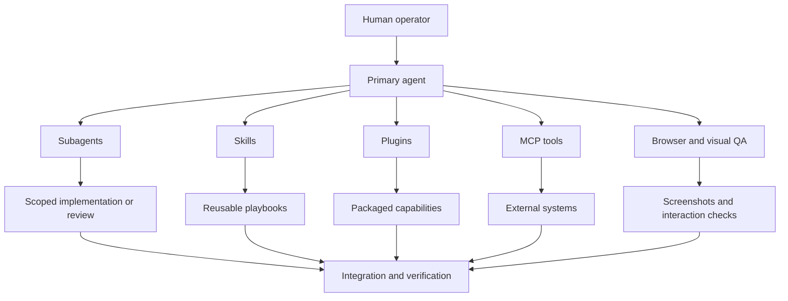

# Architecture

O stack é organizado em camadas. A intenção é deixar cada capacidade visível, mas manter o estado privado fora do repo.

## Primary Agent

O agente principal mantém contexto, decide escopo, integra resultados e faz a verificação final. Ele não precisa executar sozinho todo trabalho mecânico quando existem frentes independentes.

## Skills

Skills são playbooks versionáveis. Elas descrevem quando usar uma abordagem, quais passos seguir, que arquivos ler e como validar o resultado.

Neste snapshot, as skills foram agrupadas por fonte:

- `codex-direct`
- `agents-direct`
- `claude-direct`
- `claude-dot-agents`
- `codex-plugin-derived`
- `claude-plugin-derived`

## Plugins

Plugins empacotam skills, hooks, MCPs, comandos e integrações. No repo público, plugins aparecem por nome, marketplace, versão e fonte pública quando disponível.

## MCPs

MCPs conectam o agente a sistemas externos ou runtimes locais. Como podem carregar credenciais e estado, este repo só publica o nome e o tipo de transporte.

## Browser Automation

Browser automation entra como uma camada de validação prática: abrir app local, interagir, testar responsividade e gerar evidência visual. O repo documenta o padrão, mas não inclui screenshots privadas ou sessões autenticadas.

## Verificação

Toda mudança no catálogo deve passar por:

1. regeneração do inventário;
2. varredura de privacidade;
3. revisão manual do diff.
